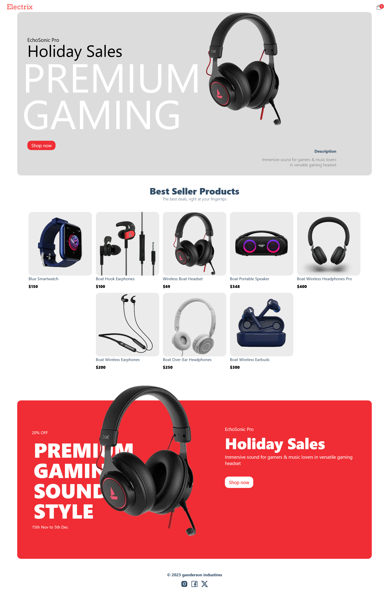
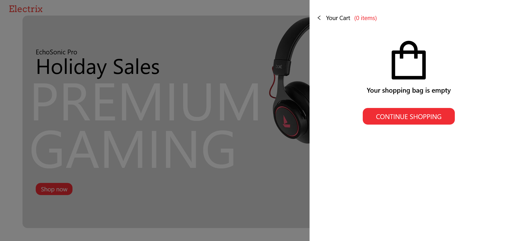
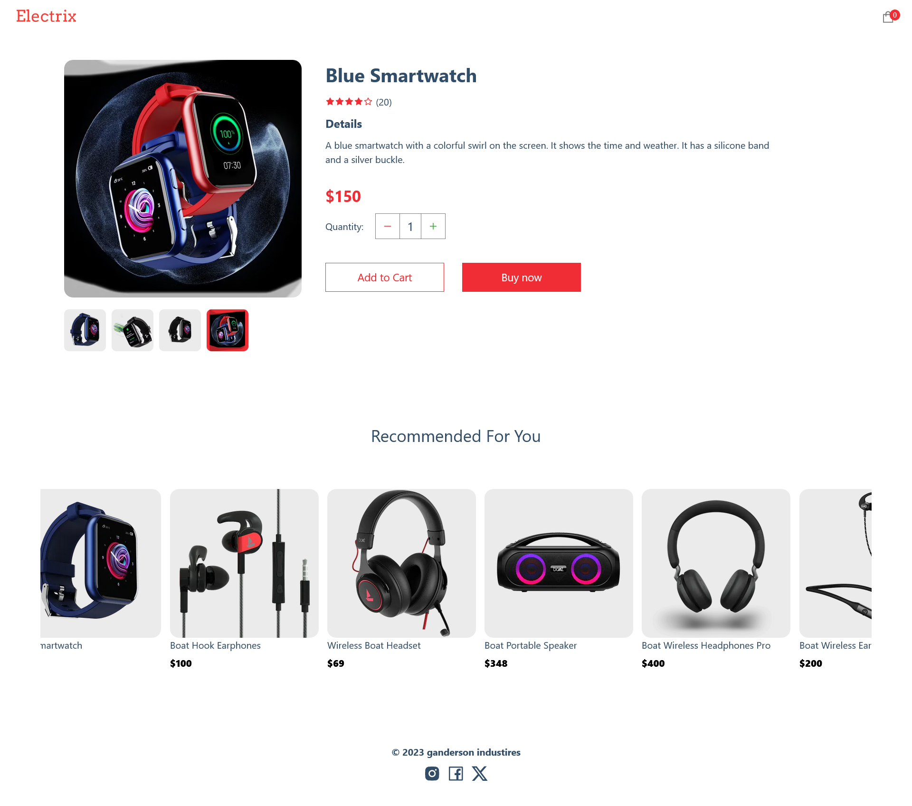
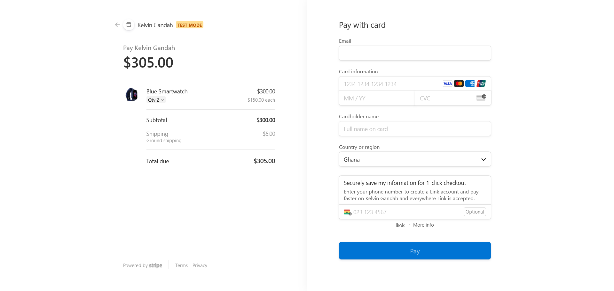
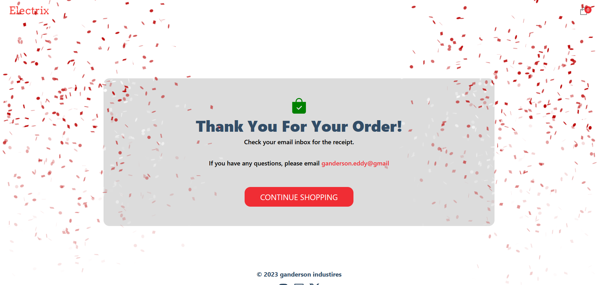
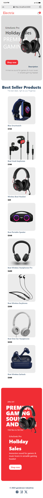

# Portfolio Project - Ecommerce App

## Table of contents

- [Portfolio Project - Ecommerce App](#portfolio-project---ecommerce-app)
  - [Table of contents](#table-of-contents)
  - [Overview](#overview)
    - [App Features](#app-features)
    - [Screenshots](#screenshots)
      - [Desktop](#desktop)
      - [Mobile](#mobile)
    - [Links](#links)
    - [Built with](#built-with)
    - [Continued development](#continued-development)
  - [Author](#author)

## Overview

### App Features

- **Product Catalog**: Browse a wide range of products.
- **Shopping Cart**: Add items to your cart and manage them easily.
- **Pay with Stripe**: Make payment with stripe.

### Screenshots

#### Desktop

#### Mobile

### Links

- GitHub Repo: [View Repo](https://github.com/Gandah/ecommerce-app.git)
- Live Site URL: [Visit Site](./)

### Built with

- Sanity CMS
- Canvans Confetti
- Stripe API
- Mobile-first workflow
- [NEXT JS](https://reactjs.org/) - JS library
- [Tailwind Css](https://tailwindcss.com/) - Css framework
- React icons
- Canvas Confetti

### Continued development

- Improve user interface
- Add extra functionalities

## Author

- Website - [MyLinkedIn](https://www.linkedin.com/in/gandahkelvin)
- Twitter - [@mr_g4nderson](https://twitter.com/mr_g4nderson?t=A5NobjZab2sVEdh3Zq9s0A&s=09)

